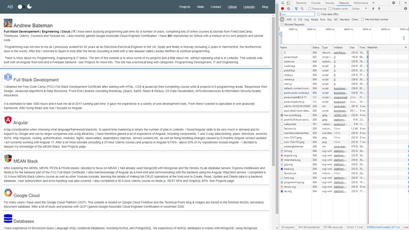

# :zap: Portfolio Angular Material

* Angular 12 Server Side Rendered (SSR) app using Angular Material to create a fully-responsive portfolio website with a Firebase backend storing blog post entries, images as well as messages from users.
* Includes dark-mode toggle and lazy-loading modules.
* **Note:** to open web links in a new window use: _ctrl+click on link_


## :page_facing_up: Table of contents

* [General info](#general-info)
* [Screenshots](#screenshots)
* [Technologies](#technologies)
* [Setup](#setup)
* [Features](#features)
* [Status](#status)
* [Inspiration](#inspiration)
* [Contact](#contact)

## :books: General info

* **Responsive:** Pages resize using Angular flex layout and grids of Angular Material mat-cards. Using breakpoint sizes from [Angular Flex Layout Documentation](https://github.com/angular/flex-layout/wiki/Responsive-API):
* **Navbars:** Top/side navbars with page routing & links to Github & LinkedIn.
* **Footer** with link to Build information page
* **Home:** Angular Material cards used to display data, using data-binding from an array of 'areas' based on an Area model.
* **Projects:** fxFlex layout with cards to display project data using data-binding from an array of projects based on a Project model. Cards are sized so up to 4 will show on a row before wrapping to the next line.
* **Skills:** fxFlex layout with cards to display project data using data-binding from an array of skills based on a Skill model. Cards are sized so up to 4 will show on a row before wrapping to the next line.
* **Contact:** Simple mat-form that user can fill in with name, email and comment. Input validation is included - Send button disabled if form incomplete/incorrect. Buttons to navigate to previous page and to clear the form. The data is sent to the app Firestore backend using angularfire-lite and a success message is returned once sending is complete. Large buttons allow user to return to Home page or send another message (which actually navigates 'back' to the same page presenting a clear form).
* **Blog:** Posts are stored in the app Firebase DB and displayed on the Blog Posts page. No authorization required to Read posts.
  Mat-cards now display Post title, subtitle, content, post category (dev, IT or Eng), time to read (calculated using a simple Angular pipe) and how old the post is (another pipe using the npm module Day.js). The Post Detail page includes the post image, Blog Detail and the footer includes an image credit with web link to the authors page with category and date published info. **OPTION:** add Tabs so all Dev, Eng & IT posts shown in their own tabs (currently creates gaps with div.ng-star-inserted class).
* **Not Found:** In the event of the user trying to route to any page address that is not listed in the router-module a single Mat-card will display a message to the user. There is a simple button to reroute the user to the Home page.

## :camera: Screenshots

  

## :signal_strength: Technologies

* [Angular framework v12](https://angular.io/)
* [Angular Material v12](https://material.angular.io/)
* [Angular Material Icons](https://material.io/resources/icons/?style=baseline)
* [Angular service worker v12](https://angular.io/guide/service-worker-intro) added
* [Firebase v8](https://firebase.google.com) Cloud storage and authentication.
* [angularfire-lite](https://www.npmjs.com/package/angularfire-lite) lightweight wrapper to use Firebase API with Angular.
* [Reactive Extensions Library for Javascript rxjs v7](https://rxjs-dev.firebaseapp.com/)
* [rxjs share](https://rxjs.dev/api/operators/share) used to multicast (share) the original Observable with multiple subscribers to prevent more than one http fetch of Posts data in a user session - the Posts data does not change that frequently so this avoids wasting a user's mobile data quota with unnecessary http data requests
* [Dayjs v1](https://github.com/iamkun/dayjs) to convert Github UTC Timestamp to '... ago'
* [Webpack Bundle Analyser v4](https://www.npmjs.com/pawebpack-bundle-analyzerckage/webpack-bundle-analyzer) to create an 'interactive treemap visualization of the contents of all your bundles.'
* [Easy-resize.com](https://www.easy-resize.com/en/) to resize pictures online
* [svg logos](https://worldvectorlogo.com/) for Projects page

## :floppy_disk: Setup

* `ng serve` for a dev server. Navigate to `http://localhost:4200/`. The app will automatically reload if you change any of the source files
* `npm run build` to create build file with Ahead of Time (AOT) compilation (enabled by default from Angular 9). Source map explorer set to false
* `npm run build:stats` to run the webpack-bundle-analyzer & generate a stats.json file inside of the dist folder
* `npm run analyze` and navigate to `http://localhost:8888/` to see the analysis
* `npm run build:ssr` to create a build file with SSR. Add "defer" in inline css file in browser/index.html
* `npm run serve:ssr` to see the SSR on localhost
* `firebase deploy` to deploy build file to firebase hosting.

## :computer: Code Examples

* `storage.service.ts` used to store blog Posts to avoid repeated http calls to fetch the same data every time

```typescript
@Injectable()
export class StorageService {
  constructor() {}

  set(key: string, data: any): void {
    try {
      sessionStorage.setItem(key, JSON.stringify(data));
    } catch (err) {
      console.error("Error saving to localStorage", err);
    }
  }

  get(key: string): string {
    try {
      return JSON.parse(sessionStorage.getItem(key));
    } catch (err) {
      console.error("Error getting data from localStorage", err);
      return null;
    }
  }

  clear(): void {
    sessionStorage.clear();
  }
}
```

* `post.service.ts` class to get Posts collection Observable if it does not already exist using the [rxjs share method](https://rxjs.dev/api/operators/share) so the same Observable is shared the next time to avoid unnecessary http requests

```typescript
export class PostService {
  private postsCollection: Observable<BehaviorSubject<Post[]>>;
  constructor(private firestore: AngularFireLiteFirestore) {}

  getPosts(): Observable<BehaviorSubject<Post[]>> {
    if (this.postsCollection) {
      return this.postsCollection;
    } else {
      this.postsCollection = this.firestore
        .read("posts").pipe(share());
      return this.postsCollection;
    }
  }
}
```

## :cool: Features

* **Angularfire-lite** used to read blog posts and push user contact form data to firebase backend. This greatly reduces size of Vendor build bundles
* **Rxjs pluck and share methods** used to avoid unnecessary http calls and to simplify code

## :clipboard: Status & To-Do List

* Status: Working SSR. non-SSR version Built for Production, deployed to Firebase & linked to my domain - Lighthouse performance 95%, accessibility 100%, Best Practises: 100%, SEO 100% & working PWA
* To-Do: Improve lighthouse performance score: remove unused css and redo small images.
* To-Do: Projects: complete svgs & summaries
* To-Do: Skills: add more skills, green skills?
* To-Do: **Colors:** Add to styles scss to reduce repeated scss throughout app.
* To-Do: overview drg, replace contact code to send me an email

## :clap: Inspiration

* [Website by Jaxon Wright](https://jaxonwright.com/)
* [Medium article by Tomas Trajan: The complete guide to Angular Material Themes](https://medium.com/@tomastrajan/the-complete-guide-to-angular-material-themes-4d165a9d24d1)
* [Article by Paul Halliday: Angular: Performance Analysis with webpack Bundle Analyzer](https://alligator.io/angular/angular-webpack-bundle-analyzer/)
* [Blog post images from Unsplash](https://unsplash.com/)
* [Simon Grimm of Devdactic's article: How to Host Your Ionic App as a Website on Firebase & Standard Web Servers](https://devdactic.com/host-ionic-website-firebase/)
* [Okta, Holger Schmitz: What Is Angular Ivy and Why Is It Awesome?](https://developer.okta.com/blog/2020/02/12/angular-ivy)
* [Ahmed Bouchefra, Setting Up Angular Server-Side Rendering (SSR)](https://blog.jscrambler.com/setting-up-angular-server-side-rendering-ssr/)
* [Angular 8/9 SEO – Set Dynamic Page Title and Meta Tags in Universal App](https://www.positronx.io/angular-seo-set-dynamic-page-title-meta-tags-in-universal-app/)
* [Andrei Voicu: Using ESLint and Prettier with VScode in an Angular Project](https://dev.to/dreiv/using-eslint-and-prettier-with-vscode-in-an-angular-project-42ib)
* [Taonpm: compression](https://developer.aliyun.com/mirror/npm/package/compression)
* [Best practices for a clean and performant Angular application](https://www.freecodecamp.org/news/best-practices-for-a-clean-and-performant-angular-application-288e7b39eb6f/)
* [Angular Data Pipe](https://angular.io/api/common/DatePipe)
* [Article: THE PAST, PRESENT & FUTURE OF LOCAL STORAGE FOR WEB APPLICATIONS](http://diveintohtml5.info/storage.html)
* [The Beginners Guide to Service Workers and Angular](https://blog.ng-book.com/service-workers-and-angular/)

## :file_folder: License

* This project is licensed under the terms of the MIT license.

## :envelope: Contact

* Repo created by [ABateman](https://github.com/AndrewJBateman), email: gomezbateman@yahoo.com
