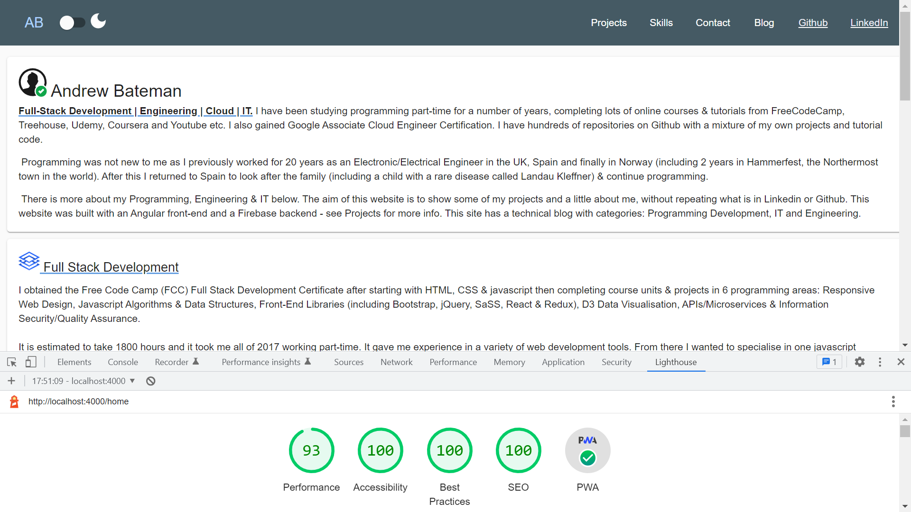
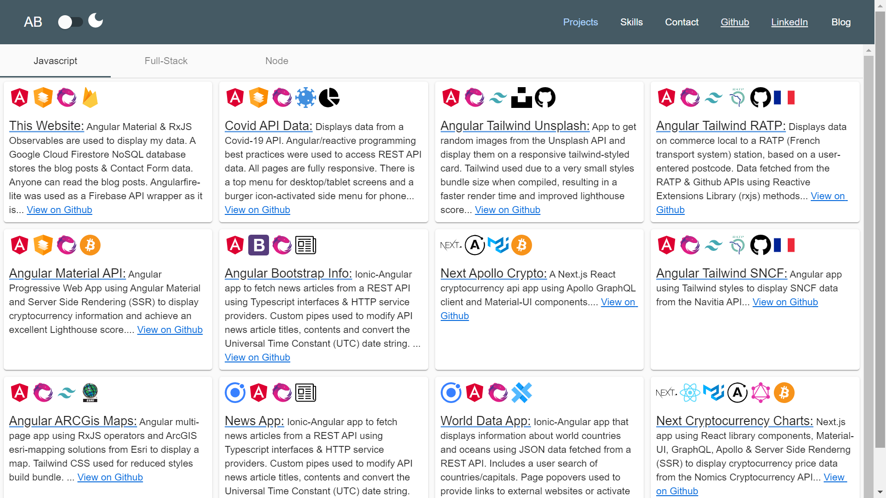
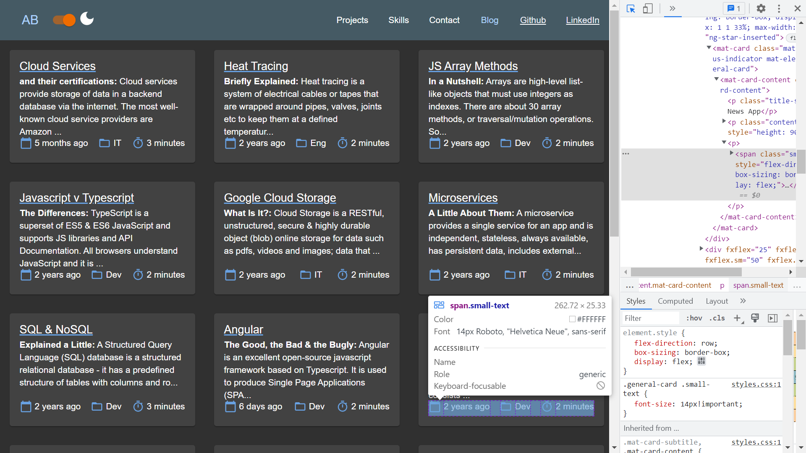
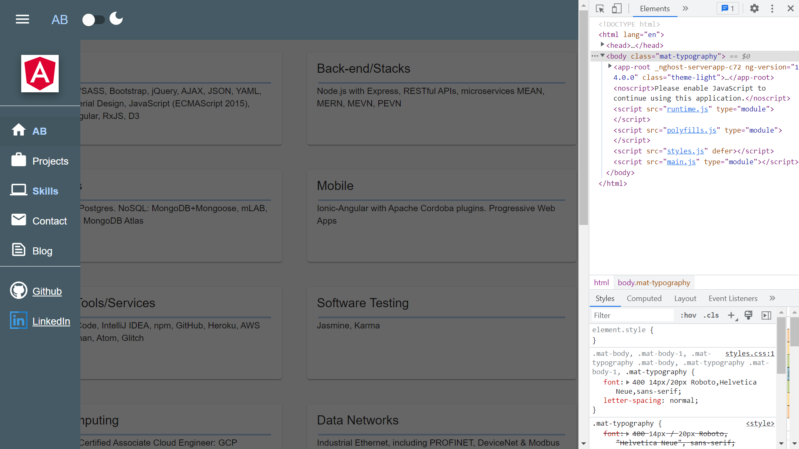

# :zap: Angular Material Portfolio

* Angular Server Side Rendered (SSR) app using Angular Material to create a fully-responsive portfolio website with a Firebase Firestore database.
* **Note:** to open web links in a new window use: _ctrl+click on link_


## :page_facing_up: Table of contents

* [:zap: Angular Material Portfolio](#zap-angular-material-portfolio)
  * [:page\_facing\_up: Table of contents](#page_facing_up-table-of-contents)
  * [:books: General info](#books-general-info)
  * [:camera: Screenshots](#camera-screenshots)
  * [:signal\_strength: Technologies](#signal_strength-technologies)
  * [:floppy\_disk: Setup](#floppy_disk-setup)
  * [:computer: Code Examples](#computer-code-examples)
  * [:cool: Features](#cool-features)
  * [:clipboard: Status \& To-Do List](#clipboard-status--to-do-list)
  * [:clap: Inspiration](#clap-inspiration)
  * [:file\_folder: License](#file_folder-license)
  * [:envelope: Contact](#envelope-contact)

## :books: General info

* **Responsive:** grid of Angular Material mat-cards using Breakpoint detection
* **Navbars:** Top/side navbars with page routing & links to Github & LinkedIn. Dark mode can be selected
* **Footer** with date & link to Build information page
* **Build Data** info. on main app dependencies
* **Home:** Angular Tab Groups/Material card grid to display data, using data-binding from an array of 'areas' based on an Area model.
* **Projects:** card grid to display project data using data-binding from an array of projects based on a Project model.
* **Skills:** card grid to display project data using data-binding from an array of skills based on a Skill model.
* **Contact:** Simple form that user can fill in with name, email and comment. Input validation is included - Send button disabled if form incomplete/incorrect. Buttons to navigate to previous page and to clear the form. The data is sent to the app Firestore backend using angularfire-lite and a success message is returned once sending is complete. Large buttons allow user to return to Home page or send another message (which actually navigates 'back' to the same page presenting a clear form).
* **Posts:** Posts are stored in the app Firebase DB and displayed using mat-tabs.
Mat-cards now display Post title, subtitle, content, time to read (calculated using a simple Angular pipe) and how old the post is (another pipe using the npm module Day.js). The Post Detail page includes the post image, Blog Detail and the footer includes an image credit with web link to the authors page and date published info.
* **Not Found:** In the event of the user trying to route to any page address that is not listed in the router-module a single Mat-card will display a message to the user. There is a simple button to reroute the user to the Home page.

## :camera: Screenshots

  
  
  
  

## :signal_strength: Technologies

* [Angular framework v16](https://angular.io/)
* [Angular Material v16](https://material.angular.io/)
* [Angular Material Icons](https://material.io/resources/icons/?style=baseline)
* [Angular service worker v16](https://angular.io/guide/service-worker-intro) added
* [Firebase v9](https://firebase.google.com) Cloud storage and authentication. **Not to be updated to v9**
* [Reactive Extensions Library for Javascript rxjs v7](https://rxjs-dev.firebaseapp.com/)
* [RxJS share](https://rxjs.dev/api/operators/share) used to multicast (share) the original Observable with multiple subscribers to prevent more than one http fetch of Posts data in a user session - the Posts data does not change that frequently so this avoids wasting a user's mobile data quota with unnecessary http data requests
* [Dayjs v1](https://github.com/iamkun/dayjs) to convert Github UTC Timestamp to '... ago'
* [Webpack Bundle Analyser v4](https://www.npmjs.com/package/webpack-bundle-analyzer) to create an 'interactive treemap visualization of the contents of all your bundles.
* [Formspree](https://formspree.io/) to send email form
* [ngx-picture](https://www.npmjs.com/package/ngx-picture) to size & lazy load images

## :floppy_disk: Setup

* `ng serve` for a dev server. Navigate to `http://localhost:4200/`. The app will automatically reload if you change any of the source files
* `npm run build` to create build file with Ahead of Time (AOT) compilation. Source map explorer set to false
* If source map explorer was set to true when build folder created: `npm run explore` to run the webpack-bundle-analyzer - opens bundle analysis drawing
* `http-server -g -b` to run build files on test server using the GZip & Brottli files
* `npm run build:ssr` to create a build file with SSR. Add "defer" in inline css file in browser/index.html
* `npm run serve:ssr` to see the SSR on localhost
* `firebase deploy` to deploy build file to firebase hosting

## :computer: Code Examples

* `core/services/breakpoint.service.ts` class to supply the number of columns based on user screen size - used by several modules to decide number of mat-cards in a grid line

```typescript
export class BreakpointService {
  breakpointObserver = inject(BreakpointObserver);
  constructor() {}

  columns$ = this.breakpointObserver
    .observe([Breakpoints.XSmall, Breakpoints.Small, Breakpoints.Medium])
    .pipe(
      map((state) => {
        return state.breakpoints[Breakpoints.XSmall]
          ? 1
          : state.breakpoints[Breakpoints.Small]
          ? 2
          : state.breakpoints[Breakpoints.Medium]
          ? 3
          : 4;
      })
    );
}
```

## :cool: Features

* common Grid card layouts with data from a shared firebase database service
* local storage dark mode and post mat-tab active settings stored so still there after refresh

## :clipboard: Status & To-Do List

* Status: Working SSR. non-SSR version Built for Production, deployed to Firebase & linked to my domain - Lighthouse performance 90%, accessibility 100%, Best Practises: 100%, SEO 100% & working PWA
* To-Do: General: fix index CSP, add text compression, reduce unused JS, cache policy 1 year?
* To-Do: Skills: add more skills  
* To-Do: Improve lighthouse performance score: remove unused CSS and redo small images.
* To-Do: Projects: add to Node projects, add Docker/Java/IoT.. projects. Serve static assets with an efficient cache policy
* To-Do: Posts: Unsplash images - use sizing website. add post

* To-Do: **Colors:** Add to styles SCSS to reduce repeated scss throughout app.
* To-Do: overview drg

## :clap: Inspiration

* [Website by Jaxon Wright](https://jaxonwright.com/)
* [Medium article by Tomas Trajan: The complete guide to Angular Material Themes](https://medium.com/@tomastrajan/the-complete-guide-to-angular-material-themes-4d165a9d24d1)
* [Article by Paul Halliday: Angular: Performance Analysis with webpack Bundle Analyzer](https://alligator.io/angular/angular-webpack-bundle-analyzer/)
* [Blog post images from Unsplash](https://unsplash.com/)
* [Simon Grimm of Devdactic's article: How to Host Your Ionic App as a Website on Firebase & Standard Web Servers](https://devdactic.com/host-ionic-website-firebase/)
* [Okta, Holger Schmitz: What Is Angular Ivy and Why Is It Awesome?](https://developer.okta.com/blog/2020/02/12/angular-ivy)
* [Ahmed Bouchefra, Setting Up Angular Server-Side Rendering (SSR)](https://blog.jscrambler.com/setting-up-angular-server-side-rendering-ssr/)
* [Angular 8/9 SEO – Set Dynamic Page Title and Meta Tags in Universal App](https://www.positronx.io/angular-seo-set-dynamic-page-title-meta-tags-in-universal-app/)
* [Andrei Voicu: Using ESLint and Prettier with VScode in an Angular Project](https://dev.to/dreiv/using-eslint-and-prettier-with-vscode-in-an-angular-project-42ib)
* [Best practices for a clean and performant Angular application](https://www.freecodecamp.org/news/best-practices-for-a-clean-and-performant-angular-application-288e7b39eb6f/)
* [Article: THE PAST, PRESENT & FUTURE OF LOCAL STORAGE FOR WEB APPLICATIONS](http://diveintohtml5.info/storage.html)
* [stackoverflow.com: Is it okay to add Angular routerLink to HTML a tags to avoid SEO issues?](https://stackoverflow.com/questions/57937451/is-it-okay-to-add-angular-routerlink-to-html-a-tags-to-avoid-seo-issues)
* [Geek Tutorials: Insert a Google Map to Your Website](https://www.youtube.com/watch?v=KIC0OK9nKXY)
* [Icons For Free](https://icons-for-free.com/)
* [Use Brotli to make your Angular app perform faster](https://danielk.tech/home/how-to-use-brotli-to-make-your-angular-app-perform-faster)

## :file_folder: License

* This project is licensed under the terms of the MIT license.

## :envelope: Contact

* Repo created by [ABateman](https://github.com/AndrewJBateman), email: `gomezbateman@yahoo.com`
