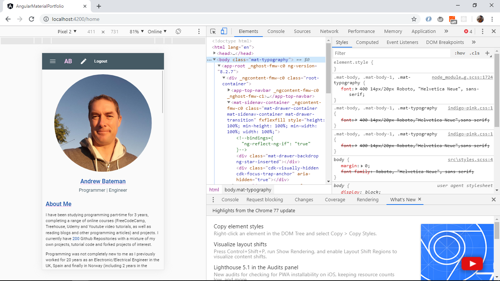
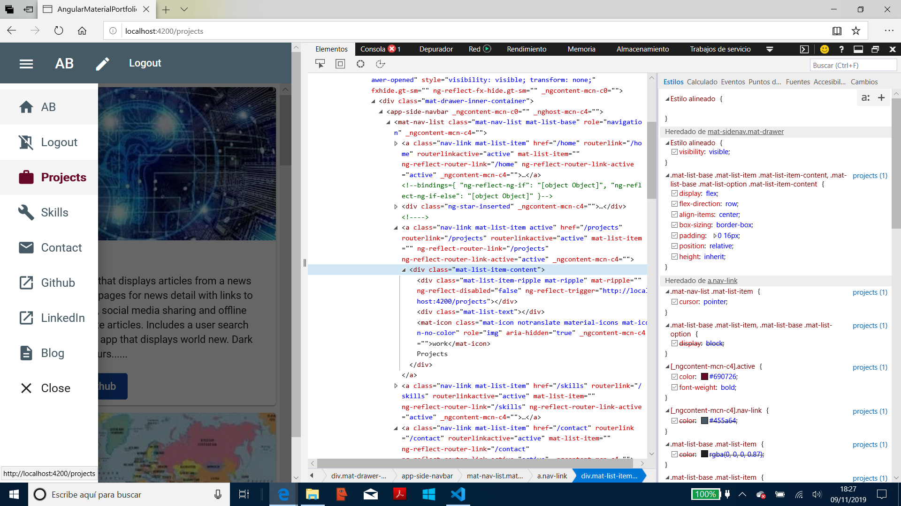
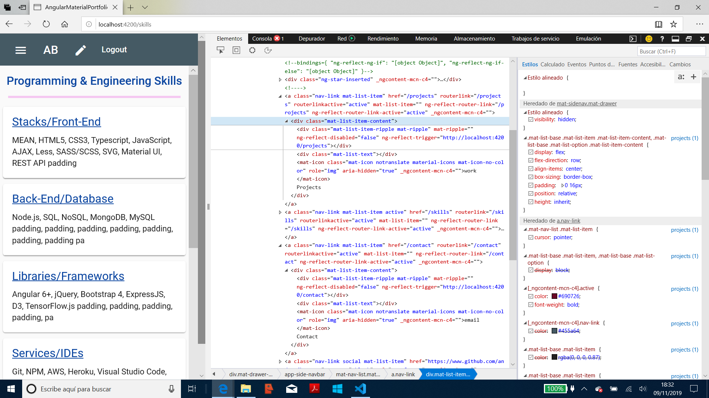
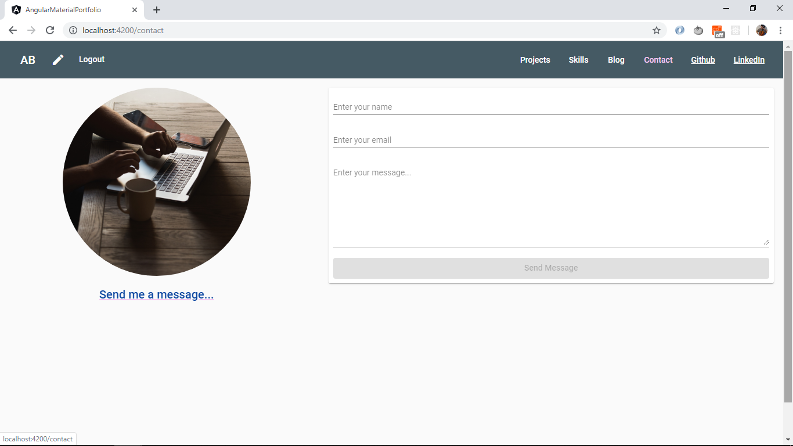
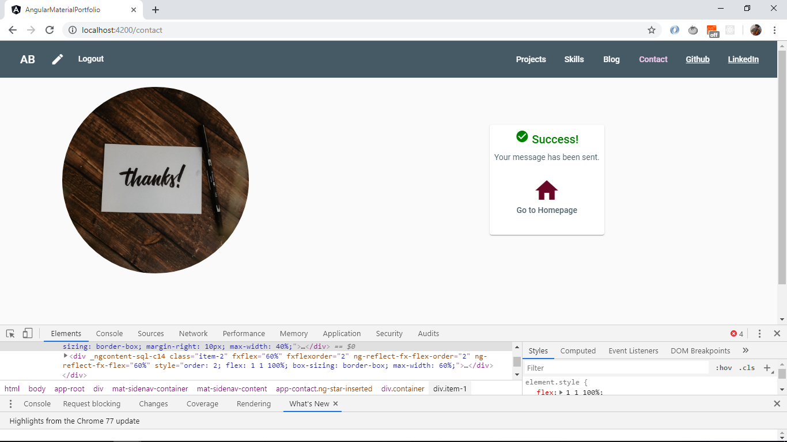
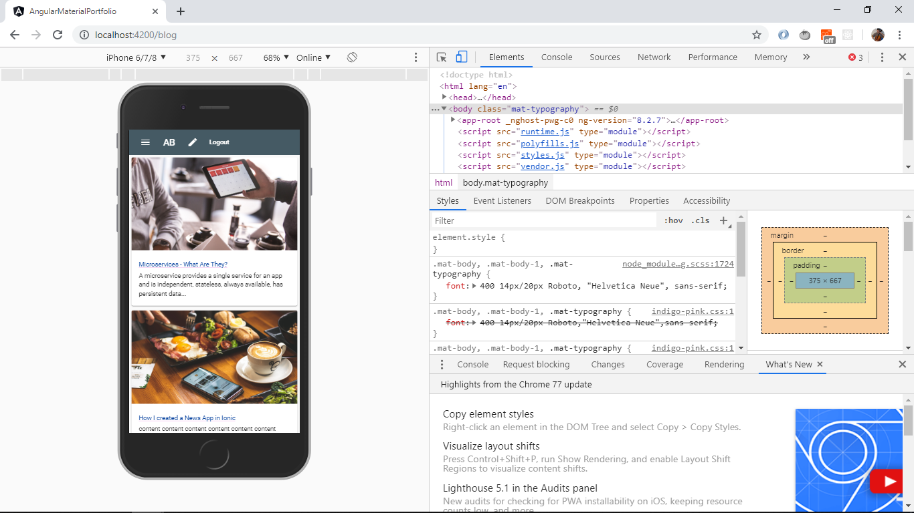
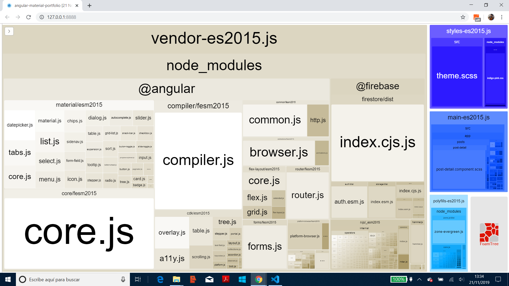

# Portfolio Angular Material

Angular 9 app using Angular Material to create a fully-responsive portfolio website with a Firebase backend storing blog post entries, images as well as Contact messages from users.

**\* Note: to open web links in a new window use: _ctrl+click on link_**

## Table of contents

- [General info](#general-info)
- [Screenshots](#screenshots)
- [Technologies](#technologies)
- [Setup](#setup)
- [Features](#features)
- [Status](#status)
- [Inspiration](#inspiration)
- [Contact](#contact)

## General info

- **Responsive:** Pages resize using Angular flex layout and grids of Angular Material mat-cards. Using breakpoint sizes:

1. desktop 1200px (anything above 1024px)
2. iPad: 768
3. bigger screens: 1024px,
4. iPhone: 320, 480px landscape

- From [Angular Flex Layout Documentation](https://github.com/angular/flex-layout/wiki/Responsive-API):

1. xs 'screen and (max-width: 599px)'
2. sm 'screen and (min-width: 600px) and (max-width: 959px)'
3. md 'screen and (min-width: 960px) and (max-width: 1279px)'
4. lg 'screen and (min-width: 1280px) and (max-width: 1919px)'
5. xl 'screen and (min-width: 1920px) and (max-width: 5000px)'

- **Build file:** TODO: reduce bundle sizes. webpack-bundle-analyzer used to analyse webpack performance. Replaced moment package with day.js as it uses less memory.

- **Colors:** Add to styles scss to reduce repeated scss throughout app.

## Sections info

- **Navbars:** Working & tidy. Top/side navbars with page routing and working links to my Github and LinkedIn profiles. Login nav-link only shown when on blog page. Not needed on side menu.

- **Home:** Working & tidy. Top section has 2 fxFlex columns with photo and text, including a Http service to display my number of repos, linked to the github API. Also displays date when Github profile page was updated. Rest of page comprises Angular Material cards used to display data on areas studied/worked, using data-binding from an array of 'areas' based on an Area model.
- **OPTION:** add link at bottom to return to the top (good for mobile phones).

- **Projects:** Working & tidy. fxFlex layout with cards to display project data using data-binding from an array of projects based on a Project model. Cards are sized so up to 2 will show on a row (on a PC) before wrapping to the next line. Image sized to 16:9 ratio. Cards simplified to get 2 on a large screen. Footer includes 3 buttons: 1 routes to Project-detail page, 1 routes to github page and 1 opens the app in a browser.
- **TODO:** ensure equal card content height in row of 2.

- **Project-Detail:** Working & tidy. Navigates to project detail page from project page link. 4 pages featured with images shown max 2 per line.
- PC app: Image size used: 892 x 502 to give 16:9 when 3 images in a row.
- mobile app: Image size used: 1066 x 600 (containes 3 x 9:16 images) to give 16:9 when 3 images in a row.
- **TODO:** Correct API data/store issue for Project 2: News App.
- **TODO:** Complete real content for Project 3: Country Data App.
- **TODO:** Complete real content for Project 4: Github Info App.
- **TODO:** Complete real content for Project 5: Cryptocurrencies App.
- **TODO:** Complete real content for Project 6: TensorFlow App.
- **TODO:** Complete real content for Project 7: WorldBank Data App.
- **TODO:** Complete real content for Project 8: Nasa Data App.

- **Skills:** Working & tidy. fxFlex layout with cards to display project data using data-binding from an array of skills based on a Skill model. Cards are sized so up to 4 will show on a row before wrapping to the next line.

- **Contact:** Working & tidy. Simple mat-form that user can fill in with name, email and comment. Input validation is included - Send button disabled if form incomplete/incorrect. Buttons to navigate to previous page and to clear the form. The data is sent to the app Firestore backend and a success message is returned once sending is complete. Large buttons allow user to return to Home page or send another message (which actually navigates 'back' to the same page presenting a clear form).
- **OPTION:** Update this to send me an email with the message.

- **Blog:** Working. Posts are stored in the app Firebase DB and displayed on the Blog Posts page. No authorization required to Read posts. Google Firebase auth service added so an authenticated user can log in to Create, Update and Delete posts.
  Mat-cards now display Post title, subtitle, content, post category (dev, IT or Eng), time to read (calculated using a simple Angular pipe) and how old the post is (another pipe using the npm module Day.js). The Post Detail page includes the Blog Detail and the footer includes an image credit with web link to the authors page. Note: I keep a backup copy of each post in `/post-backups`.
- **TODO:** change login to my email only. Complete gcp-Kubernetes Engine post

**OPTION:** It is not currently possible to Update the image in a post - consider adding this and using firestore photo sizing to get the right width to height ratio (16:9). Post create page - change size, button color? Add link to project detail page.
**OPTION:** add Tabs so all Dev, Eng & IT posts shown in their own tabs (currently creates gaps with div.ng-star-inserted class).

- **Future Updates** Dark mode toggle, CV Download, blog list mode toggle (removes photos from list page)/Field Selector to only show Dev, Eng or IT. Blog post notification - tells readers there is a new post.

## Technologies

- [Angular CLI v8.3.20](https://github.com/angular/angular-cli)
- [Angular framework v8.2.14](https://angular.io/)
- [Angular Material v8.2.3](https://material.angular.io/)
- [Angular Material Icons](https://material.io/resources/icons/?style=baseline)
- [Firebase v6.6.1](https://firebase.google.com) Cloud storage and authentication.
- [Reactive Extensions Library for Javascript rxjs v6.5.3](https://rxjs-dev.firebaseapp.com/)
- [Dayjs v1.8.17](https://github.com/iamkun/dayjs) to convert Github UTC Timestamp to '... ago'.
- [Webpack Bundle Analyser v3.6.0](https://www.npmjs.com/package/webpack-bundle-analyzer) to create an 'interactive treemap visualization of the contents of all your bundles.'.

## Setup

- Run `ng serve` for a dev server. Navigate to `http://localhost:4200/`. The app will automatically reload if you change any of the source files.
- Run `ng build` to build the project. The build artifacts will be stored in the `dist/` directory. Use the `--prod` flag for a production build.
- Run `npm run build:stats` to run the webpack-bundle-analyzer & generate a stats.json file inside of the dist folder.
- Run `npm run analyze` and navigate to `http://localhost:8888/` to see the analysis.
- Run `ng build --prod --aot` to create build file with Ahead of Time (aot) compilation.
- Run `firebase deploy` to deploy to firebase hosting.

## Code Examples

- service function to fetch blog posts, from `post.service.ts` using the `AngularFirestoreCollection` database service.

```typescript
getPosts() {
  return this.postsCollection
    .snapshotChanges()
    .pipe(
      map(
        actions => {
          return actions.map(a => {
            const data = a.payload.doc.data() as Post;
            const id = a.payload.doc.id;
            return { id, ...data };
          });
        }
      )
    );
}
```

## Features

- Services: All http calls are enclosed in their own service, in the services folder. There are 3 services:

1. posts: to get posts from the Firestore backend database,
2. github: [Github API](https://developer.github.com/v4/query/) used with a httpClient GET request to display current state of my repository.
3. auth: to authenticate users and limit write access to the Firestore backend database.

## Status & To-Do List

- Status: Working, Built for Production and Deployed to Firebase, linked to my domain.
- To-Do: see Sections Info above. Check aria labels. scss embed styles-

## Inspiration

- [Website by Julian Rubiano](http://www.julienrubiano.fr/)
- [Website by Jaxon Wright](https://jaxonwright.com/)
- [Medium article by Tomas Trajan: The complete guide to Angular Material Themes](https://medium.com/@tomastrajan/the-complete-guide-to-angular-material-themes-4d165a9d24d1)
- [Article by Paul Halliday: Angular: Performance Analysis with webpack Bundle Analyzer](https://alligator.io/angular/angular-webpack-bundle-analyzer/)
- [Blog post images from Unsplash](https://unsplash.com/)
- [Simon Grimm of Devdactic's article: How to Host Your Ionic App as a Website on Firebase & Standard Web Servers](https://devdactic.com/host-ionic-website-firebase/)
- [Okta, Holger Schmitz: What Is Angular Ivy and Why Is It Awesome?](https://developer.okta.com/blog/2020/02/12/angular-ivy)

## Screenshots

- Home page - PC and Mobile
  
  

- Project page - PC and Mobile
  
  

- Skills page - PC and Mobile
  
  

- Contact page before & after sending - PC
  
  

- Contact page before & after sending - Mobile
  
  

- Blog Posts List page - PC and Mobile size
  
  
  

- Webpack Bundle Analyzer 21 november 2019
  

## Contact

Created by [ABateman](https://www.andrewbateman.org) - feel free to contact me!
