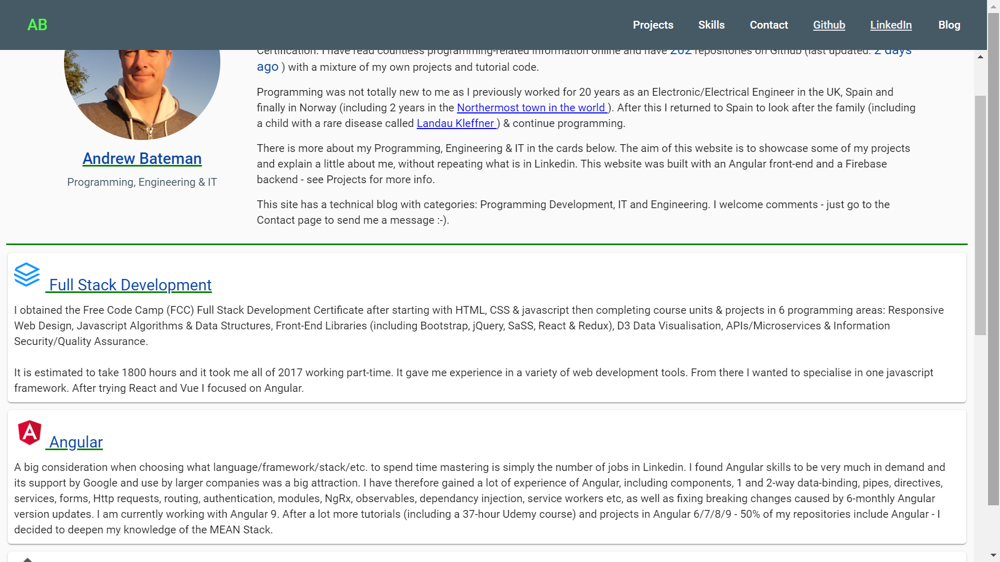
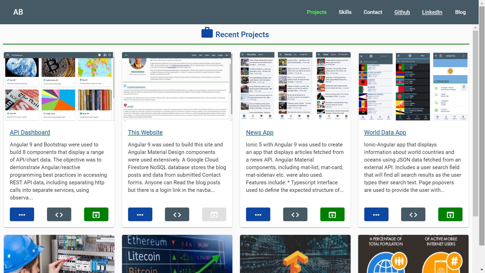
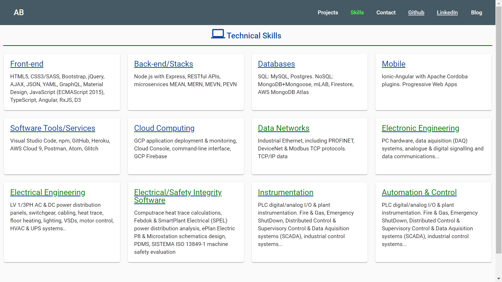
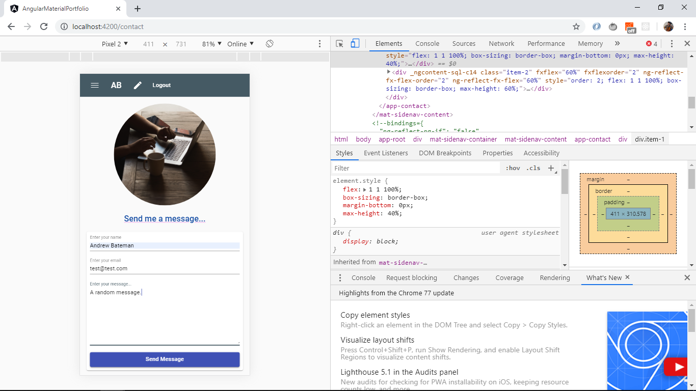
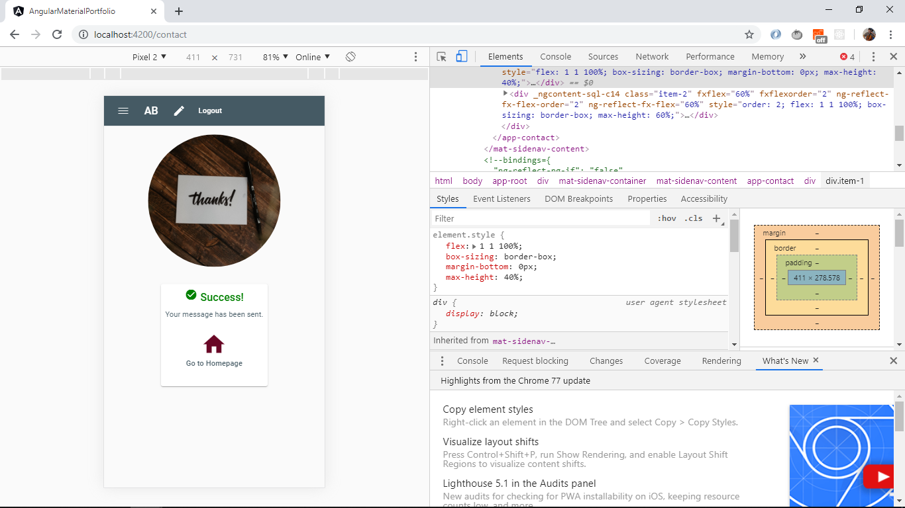
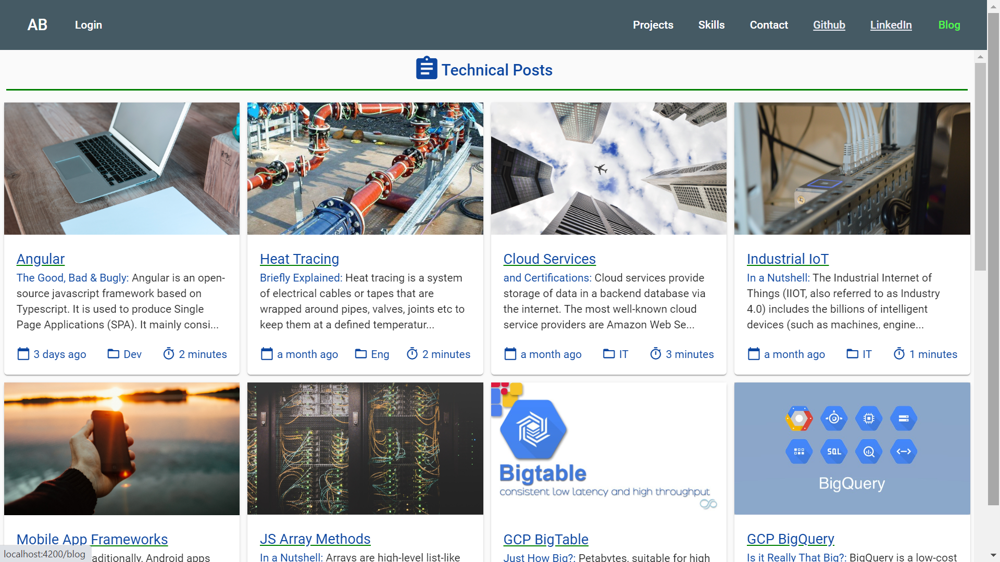
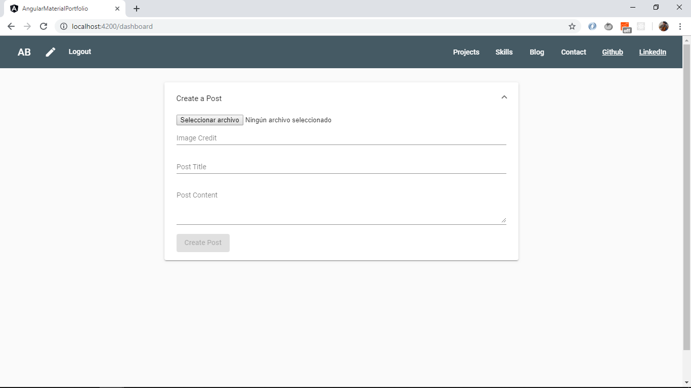

# :zap: Portfolio Angular Material

* Angular Server Side Rendered app using Angular Material to create a fully-responsive portfolio website with a Firebase backend storing blog post entries, images as well as messages from users. Dark-mode toggle. Lazy-loading modules.

**\* Note: to open web links in a new window use: _ctrl+click on link_**

## :page_facing_up: Table of contents

* [General info](#general-info)
* [Screenshots](#screenshots)
* [Technologies](#technologies)
* [Setup](#setup)
* [Features](#features)
* [Status](#status)
* [Inspiration](#inspiration)
* [Contact](#contact)

## :books: General info

**Responsive:** Pages resize using Angular flex layout and grids of Angular Material mat-cards. Using breakpoint sizes from [Angular Flex Layout Documentation](https://github.com/angular/flex-layout/wiki/Responsive-API):

## :books: Sections info

**Navbars:** Top/side navbars with page routing and working links to my CV, Github and LinkedIn profiles. Login nav-link only shown when on blog page. Not needed on side menu.

**Home:** Includes a Http service to fetch my repo details from the github API. Angular Material cards used to display data, using data-binding from an array of 'areas' based on an Area model.

**Projects:** fxFlex layout with cards to display project data using data-binding from an array of projects based on a Project model. Cards are sized so up to 2 will show on a row (on a PC) before wrapping to the next line. Image sized to 16:9 ratio. Cards simplified to get 2 on a large screen. Footer includes 3 buttons: 1 routes to Project-detail page, 1 routes to github page and 1 opens the app in a browser.

**Project-Detail:** Navigates to project detail page from project page link. pages featured with images shown max 2 per line. Top card includes buttons to navigate back or to see code/app.

* PC app: Image size used: 892 x 502 to give 16:9 when 3 images in a row.
* mobile app: Image size used: 1066 x 600 (containes 3 x 9:16 images) to give 16:9 when 3 images in a row.

**Skills:** fxFlex layout with cards to display project data using data-binding from an array of skills based on a Skill model. Cards are sized so up to 4 will show on a row before wrapping to the next line.

**Contact:** Simple mat-form that user can fill in with name, email and comment. Input validation is included - Send button disabled if form incomplete/incorrect. Buttons to navigate to previous page and to clear the form. The data is sent to the app Firestore backend using angularfire-lite and a success message is returned once sending is complete. Large buttons allow user to return to Home page or send another message (which actually navigates 'back' to the same page presenting a clear form).

**Blog:** Posts are stored in the app Firebase DB and displayed on the Blog Posts page. No authorization required to Read posts.
  Mat-cards now display Post title, subtitle, content, post category (dev, IT or Eng), time to read (calculated using a simple Angular pipe) and how old the post is (another pipe using the npm module Day.js). The Post Detail page includes the post image, Blog Detail and the footer includes an image credit with web link to the authors page with category and date published info. **OPTION:** add Tabs so all Dev, Eng & IT posts shown in their own tabs (currently creates gaps with div.ng-star-inserted class).

## :signal_strength: Technologies

* [Angular framework v11](https://angular.io/)
* [Angular Material v11](https://material.angular.io/)
* [Angular Material Icons](https://material.io/resources/icons/?style=baseline)
* [Angular service worker v11](https://angular.io/guide/service-worker-intro) added
* [Firebase v8](https://firebase.google.com) Cloud storage and authentication.
* [angularfire-lite](https://www.npmjs.com/package/angularfire-lite) lightweight wrapper to use Firebase API with Angular.
* [Reactive Extensions Library for Javascript rxjs v6](https://rxjs-dev.firebaseapp.com/)
* [Dayjs v1](https://github.com/iamkun/dayjs) to convert Github UTC Timestamp to '... ago'
* [Webpack Bundle Analyser v4](https://www.npmjs.com/pawebpack-bundle-analyzerckage/webpack-bundle-analyzer) to create an 'interactive treemap visualization of the contents of all your bundles.'
* [Easy-resize.com](https://www.easy-resize.com/en/) to resize pictures online

## :floppy_disk: Setup

* Run `ng serve` for a dev server. Navigate to `http://localhost:4200/`. The app will automatically reload if you change any of the source files
* Run `npm run build` to create build file with Ahead of Time (aot) compilation (enabled by default from Angular 9) and with source map explorer
* Run `npm run build:stats` to run the webpack-bundle-analyzer & generate a stats.json file inside of the dist folder
* Run `npm run analyze` and navigate to `http://localhost:8888/` to see the analysis
* Run `npm run build:ssr` to create a build file with SSR. Add "defer" in inline css file in browser/index.html
* Run `npm run serve:ssr` to see the SSR on localhost
* Run `firebase deploy` to deploy build file to firebase hosting. (`ng deploy` does not work due to [errors with SSR](https://stackoverflow.com/questions/61913016/angular-npm-run-servessr-fails))

## :computer: Code Examples

* extract from `github.service.ts` to get number of repos from a user from Github API using the rxjs pluck method 

```typescript
getNumberRepos(): Observable<number> {
    const githubUrl = "https://api.github.com/users/andrewjbateman";
    return this.http.get<User>(githubUrl).pipe(
      pluck("public_repos"),
      catchError((err) => {
        return throwError(
          "There was a problem fetching data from Github API, error: ",
          err
        );
      })
    );
  }
```

## :cool: Features

* Services: All http calls are enclosed in their own service, in the services folder. There are 2 services:

**posts:** to get posts from the Firestore backend database, **github:** [Github API](https://developer.github.com/v4/query/) used with a httpClient GET request to display number of my Git repositories.

* Angularfire-lite used to read blog posts and push user contact form data to firebase backend. This reduces size of Vendor build bundles

## :clipboard: Status & To-Do List

* Status: Working, Built for Production and Deployed to Firebase, linked to my domain. Browser only version deployed.
* SSR Lighthouse PC score: Performance 94%, Accessibility: 100%, Best practises: 100% & SEO: 100%, PWA OK
* To-Do: Fix dark-mode links (image credit etc.) to be in white not blue
* To-Do: Improve lighthouse performance score: remove unused css and redo small images.
* To-Do: Blog: rewrite posts and replace images with lighter ones in firebase storage.
* To-Do: Projects: add projects and reduce image sizes
* To-Do: deploy with SSR (fix)
* To-Do: **Colors:** Add to styles scss to reduce repeated scss throughout app.

## :clap: Inspiration

* [Website by Jaxon Wright](https://jaxonwright.com/)
* [Medium article by Tomas Trajan: The complete guide to Angular Material Themes](https://medium.com/@tomastrajan/the-complete-guide-to-angular-material-themes-4d165a9d24d1)
* [Article by Paul Halliday: Angular: Performance Analysis with webpack Bundle Analyzer](https://alligator.io/angular/angular-webpack-bundle-analyzer/)
* [Blog post images from Unsplash](https://unsplash.com/)
* [Simon Grimm of Devdactic's article: How to Host Your Ionic App as a Website on Firebase & Standard Web Servers](https://devdactic.com/host-ionic-website-firebase/)
* [Okta, Holger Schmitz: What Is Angular Ivy and Why Is It Awesome?](https://developer.okta.com/blog/2020/02/12/angular-ivy)
* [Ahmed Bouchefra, Setting Up Angular Server-Side Rendering (SSR)](https://blog.jscrambler.com/setting-up-angular-server-side-rendering-ssr/)
* [Angular 8/9 SEO – Set Dynamic Page Title and Meta Tags in Universal App](https://www.positronx.io/angular-seo-set-dynamic-page-title-meta-tags-in-universal-app/)
* [Andrei Voicu: Using ESLint and Prettier with VScode in an Angular Project](https://dev.to/dreiv/using-eslint-and-prettier-with-vscode-in-an-angular-project-42ib)
* [Taonpm: compression](https://developer.aliyun.com/mirror/npm/package/compression)
* [Best practices for a clean and performant Angular application](https://www.freecodecamp.org/news/best-practices-for-a-clean-and-performant-angular-application-288e7b39eb6f/)
* [Angular Data Pipe](https://angular.io/api/common/DatePipe)

## :camera: Screenshots

* Home page
  

* Project page
  
  

* Skills page
  

* Contact page before & after sending - Mobile
  
  

* Blog Posts List page
  
  

## :envelope: Contact

* Repo created by [ABateman](https://www.andrewbateman.org) - you are welcome to [send me a message](https://andrewbateman.org/contact)
